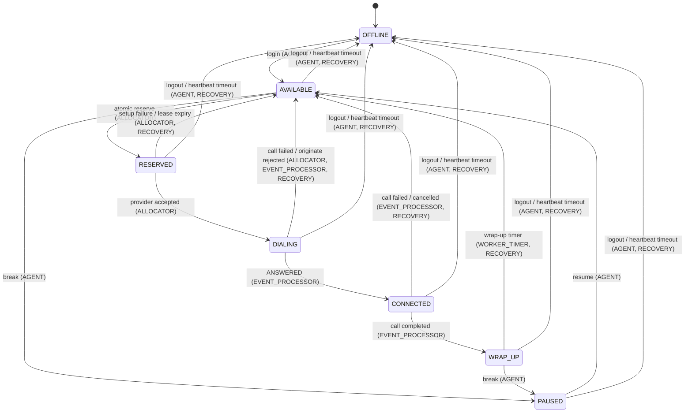

# Agent State Machine

The authoritative encoding lives in `app/state_machines/agent_sm.py` (`AGENT_TRANSITIONS` and
`TRANSITION_ACTORS`). This document mirrors those tables. The exhaustive matrix tests in
`tests/test_agent_state_machine.py` fail if code and this document drift apart.

## State meanings

| State | Meaning | Claimable | Counts as busy |
|---|---|---|---|
| `OFFLINE` | Not logged in, or the heartbeat expired. | no | no |
| `AVAILABLE` | Logged in and idle. The only claimable state. | **yes** | no |
| `RESERVED` | A worker holds an atomic lease; call setup in progress. | no | yes |
| `DIALING` | Call handed to the provider, not yet answered. | no | yes |
| `CONNECTED` | Agent is talking to a borrower. | no | yes |
| `WRAP_UP` | Post-call disposition, time-boxed. | no | yes |
| `PAUSED` | Deliberately unavailable. | no | no |

## Transition actors

`ALLOCATOR`, `EVENT_PROCESSOR`, `RECOVERY`, `AGENT`, `WORKER_TIMER`.

Actor enforcement is what stops one component doing another's job: an `EVENT_PROCESSOR` cannot
reserve an agent, and an `ALLOCATOR` cannot mark a call connected. `validate_transition` raises
`UnauthorizedTransitionActor` for those attempts, separately from `InvalidStateTransition`.

## Explicitly invalid transitions

`AVAILABLE -> CONNECTED`, `RESERVED -> CONNECTED`, `OFFLINE -> RESERVED`, `WRAP_UP -> DIALING`,
`PAUSED -> RESERVED`, and every self-transition. Any transition attempted by a worker that does
not hold the lease is rejected by the reservation layer rather than by this table.

## Validation is not concurrency safety

These functions are pure and answer only "is this transition legal?". They cannot answer "did I
win the race?". A legal transition applied with a plain read-then-write would still allow two
workers to reserve the same agent. Legality must always be paired with the atomic conditional
update in `app/repositories/agent_repo.py`, where the current state is part of the MongoDB filter.
