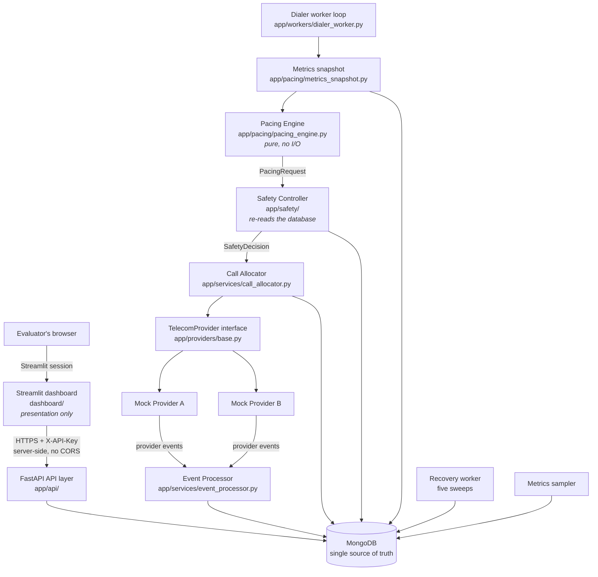

# Architecture

## System diagram

Only `app/` opens a database connection. The dashboard reaches the system exclusively over HTTP.

## Component responsibilities

| Component | Owns | Must never |
|---|---|---|
| `app/models/` | Domain shape, enums, validation | Contain query or transition logic |
| `app/state_machines/` | Which transitions are legal and who may trigger them | Touch the database or a provider |
| `app/repositories/` | Every database query; atomic conditional claims | Contain business decisions |
| `app/services/reservation_service.py` | Claim-then-compensate for an agent + borrower pair | Create calls or dial |
| `app/services/call_allocator.py` | Turning an approved slot count into real calls | Accept anything other than a `SafetyDecision` |
| `app/services/event_processor.py` | Idempotent, order-safe event application | Decide how many calls to place |
| `app/services/provider_health.py` | Rolling health scoring and the retry gate | Change dialing volume directly |
| `app/services/retry_service.py` | Every retry decision, in one place | Be bypassed by a second call site |
| `app/pacing/` | The predictive formula and its explanation | Import a provider or the allocator |
| `app/safety/` | The eight hard constraints and the verdict | Trust numbers supplied by the pacing engine |
| `app/dialers/` | Wiring snapshot → pacing → safety → allocation | Skip the Safety Controller |
| `app/providers/` | Telecom behaviour behind one interface | Import a repository, service or dialer |
| `app/workers/` | The dialer and recovery loops | Contain business rules |
| `app/api/` | HTTP contract, validation, error envelope | Contain business logic |
| `dashboard/` | Display | Import `app/`, open a database, or hold state |

## Dependency rules

These are enforced by tests, not just documented:

1. **`app/pacing/` and `app/safety/` import no provider module and no allocator module.**
   `tests/test_architecture_boundaries.py`.
2. **`CallAllocator.allocate` accepts a `SafetyDecision`, never a bare integer.** Same test file,
   by signature inspection and an AST scan for `allocate(<int literal>)`.
3. **The Safety Controller is evaluated before the allocator is called**, verified by source order
   in `app/dialers/base.py`.
4. **`app/providers/` imports only from `app/providers/`.** Nothing else, so the dialer is never
   coupled to a concrete carrier.
5. **`dashboard/` imports nothing from `app/`, `motor`, `pymongo` or `fastapi`.**
   `tests/test_dashboard_boundary.py`.
6. **No read-then-write reservation pattern anywhere** — every reservation write is a conditional
   update whose filter contains the expected state.

## The dashboard boundary, and why it needs enforcing

A JavaScript SPA is *physically incapable* of importing backend Python. Streamlit is not: it is
Python, it lives in the same repository, and `from app.services.call_allocator import allocate`
would work. That single line would let the dashboard dial without passing through the Safety
Controller and would make the UI a second, competing source of truth.

So the separation the previous design got for free is enforced deliberately:

1. `dashboard/` may import nothing from `app/`.
2. The dashboard opens no database connection and has no `MONGODB_URI` — in local runs *and* in
   deployment.
3. The dashboard contains no pacing arithmetic, no safety evaluation, no transition rules.
4. `st.session_state` holds UI state only — selected campaign, active tab, form values.
5. Every control triggers a real API call; there are no optimistic local mutations.

Duplicating an enum *value* as a display string in `dashboard/formatting.py` is acceptable and
deliberate. Importing the enum is not.

## Data flow for one call

1. The dialer tick builds a snapshot (agent counts, call counts, answer rate, provider health).
2. The Pacing Engine turns the snapshot into a `PacingRequest` — a number and an explanation.
3. The request is persisted to `pacing_decisions`.
4. The Safety Controller **re-reads capacity from the database**, evaluates eight constraints, and
   returns a `SafetyDecision`, persisted to `safety_decisions` and linked to the pacing decision.
5. The Call Allocator loops `decision.approved` times: atomically claim an agent, atomically claim a
   borrower, create a call with a unique `idempotency_key`, move it `QUEUED → RESERVED → INITIATED`,
   move the agent to `DIALING`, then originate through the provider with a timeout.
6. The provider emits events on its own timers. The Event Processor inserts each into
   `provider_events` first — that insert *is* the duplicate gate — then applies the call transition
   under a rank guard, then the implied agent transition, then releases the borrower on terminal
   states.
7. The recovery worker sweeps for anything left behind.
