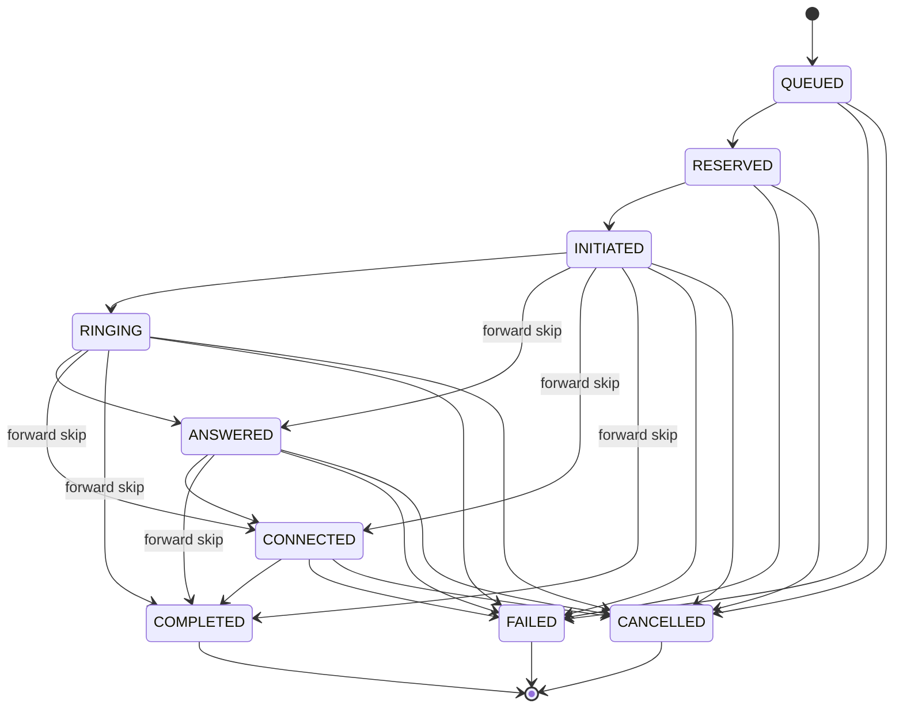

# Call State Machine

The authoritative encoding lives in `app/state_machines/call_sm.py` (`CALL_TRANSITIONS`) and
`app/models/enums.py` (`CALL_STATE_RANK`, `TERMINAL_CALL_STATES`). The exhaustive matrix tests in
`tests/test_call_state_machine.py` fail if code and this document drift apart.

## State ranks

| State | Rank | Terminal |
|---|---|---|
| `QUEUED` | 0 | no |
| `RESERVED` | 1 | no |
| `INITIATED` | 2 | no |
| `RINGING` | 3 | no |
| `ANSWERED` | 4 | no |
| `CONNECTED` | 5 | no |
| `COMPLETED` | 6 | **yes** |
| `FAILED` | 6 | **yes** |
| `CANCELLED` | 6 | **yes** |

## The three ordering rules

`should_apply_event(current_state, target_state)` is the single place these rules live. It returns
one of four outcomes:

| Outcome | When | Effect |
|---|---|---|
| `IGNORE_TERMINAL` | The call is already terminal. | Nothing happens. `COMPLETED` then `ANSWERED` then `RINGING` leaves the call `COMPLETED`. |
| `IGNORE_STALE` | The target rank is not higher than the current rank. | Nothing happens. Covers both late events (`CONNECTED` then `RINGING`) and duplicates (`RINGING` then `RINGING`). |
| `IGNORE_INVALID` | The rank is higher but the transition contradicts the lifecycle. | Nothing happens. A provider cannot report progress on a call it was never given, so `QUEUED -> ANSWERED` is rejected. |
| `APPLY` | The rank is higher and the transition is legal. | The transition is applied. |

Forward skips are deliberately allowed from `INITIATED` onwards: if a `RINGING` event is lost, an
`ANSWERED` event must still move the call forward. A missing intermediate event must never wedge
a call in a non-terminal state.

## Implied agent transitions

`agent_state_for_call_state` maps a call state to the agent state it implies, so the event
processor does not re-derive that mapping:

| Call state | Implied agent state |
|---|---|
| `INITIATED`, `RINGING` | `DIALING` |
| `ANSWERED`, `CONNECTED` | `CONNECTED` |
| `COMPLETED` | `WRAP_UP` |
| `FAILED`, `CANCELLED` | `AVAILABLE` |
| `QUEUED`, `RESERVED` | none |

## Validation is not concurrency safety

`should_apply_event` decides whether an event *should* be applied. It cannot decide whether this
worker is the one that *gets* to apply it. The rank guard must also be part of the MongoDB filter
when the transition is written, so two concurrent processors cannot both apply the same forward
step.
